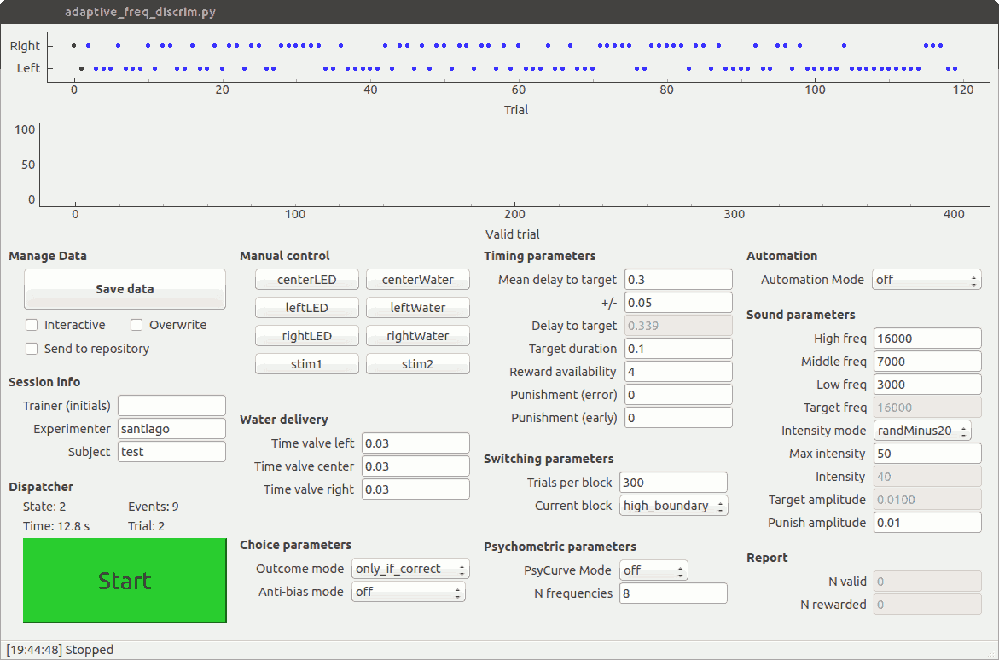

TASKontrol
==========

TASKontrol is an open source framework for developing behavioral experiments for neuroscience research.

It consists of modules written in `Python`_ and `Qt`_ (via `QtPy`_) for designing behavioral paradigms and providing a graphical user interface to control the experiments. It also includes software that runs in an `Arduino Due`_ to provide an interface for detecting external events and triggering stimuli.

TASKontrol was originally developed by Santiago Jaramillo and it is maintained by the `Jaramillo Lab`_ at the University of Oregon. The source code can be found in `GitHub`_.

.. _Python: https://www.python.org/
.. _Qt: https://www.qt.io
.. _qtpy: https://pypi.org/project/QtPy/
.. _Arduino Due: https://www.arduino.cc/en/Main/ArduinoBoardDue
.. _Jaramillo Lab: http://jaralab.uoregon.edu/
.. _Github: https://github.com/sjara/taskontrol

Below is an example of a graphical user interface created with TASKontrol.

**NOTE:** This documentation is a work in progress and pages for some modules are not yet available. However, these documents should be sufficient to get you started with TASKontrol.

Contents:
^^^^^^^^^
.. toctree::
   :maxdepth: 2

   getting_started
   state_transitions
   inputs_outputs
   extratimers
   advanced_topics
   reference

..   settings
..   core
.. plugins

Classes and methods
-------------------

* :ref:`genindex`
* :ref:`modindex`
.. * :ref:`search`

Help
----

* `reStructuredText Primer <http://www.sphinx-doc.org/en/stable/rest.html>`_.

.. taskontrol documentation master file, created by
   sphinx-quickstart on Sun Sep  1 20:20:42 2013.
   You can adapt this file completely to your liking, but it should at least
   contain the root `toctree` directive.

.. this is a test comment.
